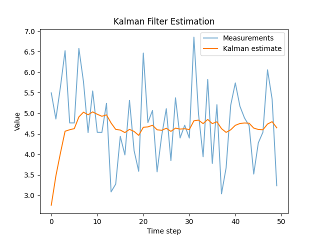
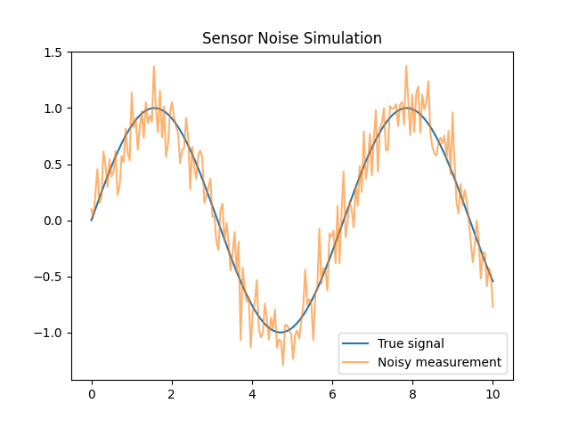

English | [Español](README.es.md)

# Sensor Noise Modeling

Minimal experiments illustrating probabilistic sensor noise and
state estimation in robotics systems.

This repository explores simple probabilistic models for sensor noise
commonly encountered in robotics and embedded perception systems.

The examples demonstrate how noisy measurements can be modeled,
filtered, and fused to improve state estimation.

## Contents

The `src/` directory contains three minimal experiments:

- `imu_noise_simulation.py`

    Simulates Gaussian noise in inertial sensor readings.

- `kalman_filter_1d.py`

    Minimal implementation of a 1D Kalman filter for signal estimation.

- `sensor_fusion_demo.py`

    Combines multiple noisy sensors to estimate a latent signal.

## Purpose

These experiments illustrate engineering concepts relevant to:

- robotics perception
- probabilistic state estimation
- sensor uncertainty modeling

## Motivation

Understanding sensor uncertainty and state-based behaviour is fundamental
for robotics and cyber-physical systems, where real-world measurements are
noisy and system behaviour must be structured under uncertainty.

## Method

The repository implements simple probabilistic simulations of sensor noise and state estimation processes commonly encountered in robotics and embedded perception systems.

The experiments include:

- Simulation of Gaussian noise in inertial sensors  
- Kalman filtering for signal estimation  
- basic sensor fusion across noisy measurements  

These simplified implementations aim to illustrate the core ideas
behind probabilistic state estimation in cyber-physical systems.

These examples are intentionally minimal and are designed to highlight
the conceptual behaviour of probabilistic filters rather than production
sensor processing pipelines.

## Running the examples

Clone the repository and run any of the scripts:

```bash
git clone https://github.com/Jorge-de-la-Flor/sensor-uncertainty-lab
cd sensor-uncertainty-lab
python kalman_filter_1d.py
```

Each script generates simulated noisy sensor measurements and visualises the resulting state estimation process.

## Example output




## Project tree

```bash
sensor-uncertainty-lab
├─ .python-version
├─ README.es.md
├─ README.md
├─ assets
│  ├─ kalman_estimate.png
│  └─ sensor_noise.png
├─ pyproject.toml
├─ src
│  ├─ imu_noise_simulation.py
│  ├─ kalman_filter_1d.py
│  └─ sensor_fusion_demo.py
└─ uv.lock
```

## Requirements

The examples use:

- Python 3.12+
- NumPy
- Matplotlib

## Installation

Install the required dependencies:

- using `pip`

```bash
pip install numpy matplotlib
```

- using `uv`

```bash
uv add numpy matplotlib
```

## References

- Welch, G., & Bishop, G. (2006).  
  *An Introduction to the Kalman Filter.*

- Thrun, S., Burgard, W., & Fox, D. (2005).  
  *Probabilistic Robotics.*
